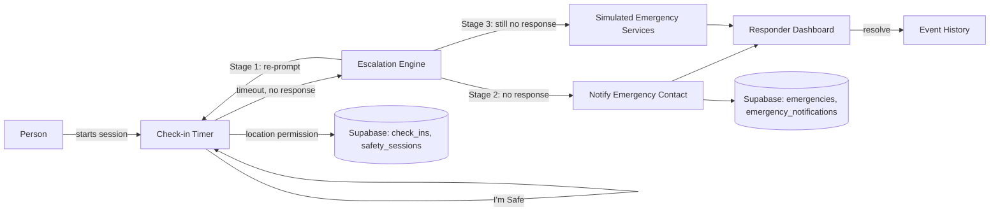

# Lifeline

**Help when you need it — even when you can't ask for it.**

Lifeline is a personal safety web app that checks in on you, and escalates to your emergency contacts if you go quiet.

🔗 **[Live Demo](https://safe-whisper-heartbeat.lovable.app)** | 📦 [Repo](https://github.com/Shallilla/safe-whisper-heartbeat)


---

## The Problem

Millions of people live alone, travel solo, or find themselves in situations where they simply can't reach out for help — a fall, a medical event, an unsafe ride, a hike gone wrong. Existing safety apps require the user to actively press a button *in the moment of crisis*, which is exactly when they may be unable to.

Lifeline flips that: it checks in periodically, and if the user doesn't confirm they're safe, it escalates on its own — no action required from someone who may not be able to act.

## What We Built

Lifeline implements the full **Detect → Check → Escalate → Locate → Respond** loop as a real, working app — not a mockup:

- **Safety check-ins** — user sets an interval (30 min, 1h, 2h, 4h, custom); a live countdown runs and prompts "Are you safe?" when it hits zero
-  **Automatic escalation** — no response triggers a staged escalation: re-prompt → notify emergency contact → simulated emergency-services escalation
-  **Emergency Mode** — a dedicated, high-contrast, stress-usable screen with live status, location, and a one-tap "I'm Safe" or "Cancel Emergency" (with confirmation)
-  **Location sharing** — captures and displays the user's last known location via the browser Geolocation API, viewable by emergency contacts
- **Emergency contacts** — add, edit, prioritize, and designate a primary contact
-  **Responder dashboard** — a separate `/responder` view simulating what a trusted contact sees: active emergencies, last check-in, location, and controls to start/resolve a response
-  **Safety modes** — Standard, Living Alone, and Travel (destination + expected arrival, auto-escalates if you're late)
-  **Event history** — every check-in, miss, escalation, and resolution is logged
-  **Demo Mode** — simulate a missed check-in or a full emergency instantly, built specifically so the whole flow can be shown live in a pitch without waiting on real timers

> ⚠️ Lifeline is a prototype. It does not contact real emergency services or send real SMS/email — all responder-side alerts are simulated inside the app for demo purposes.

## Tech Stack

- **Frontend:** React 19, TypeScript, TanStack Router/Start, Tailwind CSS 4, Radix UI, Lucide icons
- **Backend / Data:** Supabase (Postgres, Auth, Row Level Security)
- **Location:** Browser Geolocation API
- **Notifications:** Browser Notifications API
- **Charts:** Recharts (history/status views)
- **Built with:** [Lovable](https://lovable.dev)

## Architecture



Core tables: `profiles`, `emergency_contacts`, `safety_sessions`, `check_ins`, `emergencies`, `emergency_notifications` — all with RLS so a user can only ever see their own data, and the responder view only sees what's meant for the demo.

## Getting Started

```bash
git clone https://github.com/Shallilla/safe-whisper-heartbeat.git
cd safe-whisper-heartbeat
npm i
npm run dev
```

You'll need a Supabase project (URL + anon key) wired up for auth and the tables above — see `supabase/migrations` for the schema.


## What's Next

- [ ] Real SMS/email delivery for emergency contacts
- [ ] Native mobile app with background location
- [ ] Wearable integration (fall/heart-rate detection to auto-trigger check-ins)
- [ ] Multi-contact simultaneous escalation with acknowledgment tracking

## Team

Solo build for ShipHathon.

## License

MIT License — see [LICENSE](./LICENSE) for details.
